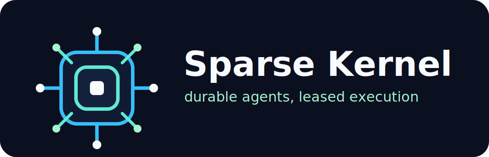

# Sparse Kernel

<p align="center">
  
</p>

<p align="center">
  <strong>Local multi-agent runtime for durable sparse execution.</strong>
</p>

<p align="center">
  <a href="https://github.com/razroo/sparse-kernel"></a>
  <a href="LICENSE"></a>
  
</p>

**Sparse Kernel** is a local runtime kernel for keeping many logical agents parked as compact durable state, then materializing only the active slice of work through leased tools, files, browsers, sandboxes, and artifacts.

It is built for personal and small-machine deployments where hundreds of agents or sessions may exist, but only a bounded number should hold expensive resources at once.

## What It Does

- Stores structured runtime state in a SQLite ledger: agents, sessions, transcript events, tasks, leases, tool calls, capabilities, audit records, artifacts, and usage.
- Schedules active work with task leases so inactive agents remain cheap durable rows instead of live processes.
- Brokers expensive resources by trust zone: browser contexts, sandbox allocations, filesystem access, tool invocation, and artifact reads/writes.
- Keeps large outputs out of SQLite by placing screenshots, traces, downloads, exported transcripts, and other blobs in a content-addressed artifact store.
- Enforces capability checks around sensitive operations and records allow, deny, grant, revoke, and broker events for auditability.
- Provides a Rust core, a local CLI/daemon, and a small TypeScript client surface for adapters.

## Why Sparse Execution

Most local agent systems scale resource usage with logical agent count. Sparse Kernel separates logical state from materialized execution:

- sleeping agents are durable state;
- active work claims bounded leases;
- browser and sandbox pools are shared by trust zone;
- artifacts are content-addressed and deduplicated;
- sensitive transitions flow through brokers that can check capabilities and write audit records.

The goal is to make local multi-agent systems practical on ordinary machines, including small VMs, without pretending that a browser context or local process is a hard isolation boundary.

## Repository Layout

- `crates/sparsekernel-core`: Rust ledger, artifact store, task leases, capabilities, audit records, and mock broker primitives.
- `crates/sparsekernel-cli`: `sparsekernel` CLI and `sparsekerneld` local daemon.
- `crates/sparsekernel-core/migrations/0001_initial.sql`: initial SQLite runtime schema.
- `packages/browser-broker`: TypeScript CDP browser broker for materialized browser-context leases and artifactized screenshots/downloads.
- `packages/openclaw-sparsekernel-adapter`: TypeScript adapter that wraps OpenClaw-shaped tools in Sparse Kernel session, capability, tool-call, and artifact lifecycle calls.
- `packages/sparsekernel-client`: TypeScript client for the daemon HTTP surface.
- `schemas/`: API and event schema definitions.
- `docs/architecture/`: architecture notes for the ledger, brokers, artifact store, trust zones, security boundaries, and small-VM resource model.

The Rust crates are workspace-internal for now (`publish = false`); run them from this repository until a crates.io release path exists.

## Quick Start

Runtime requirements:

- Rust 1.80+
- SQLite via the bundled `rusqlite` feature

Initialize the local ledger:

```bash
cargo run -p sparsekernel-cli --bin sparsekernel -- init
```

Inspect runtime state:

```bash
cargo run -p sparsekernel-cli --bin sparsekernel -- status
cargo run -p sparsekernel-cli --bin sparsekernel -- db inspect --json
```

Enqueue and list a task:

```bash
cargo run -p sparsekernel-cli --bin sparsekernel -- tasks enqueue --kind example --priority 1
cargo run -p sparsekernel-cli --bin sparsekernel -- tasks list
```

Run the local daemon:

```bash
cargo run -p sparsekernel-cli --bin sparsekerneld
```

The daemon listens on `http://127.0.0.1:8765` by default and exposes:

- `GET /health`
- `GET /status`
- `GET /sessions`
- `GET /tasks`
- `GET /tool-calls`
- `GET /audit`

It also exposes POST endpoints for session upsert, transcript event append/list, exact task claiming, task heartbeat/complete/fail, artifact create/read/metadata, capability grant/check/revoke/list, browser context acquire/release, and sandbox allocate/release.

## Storage Model

Sparse Kernel chooses its state root in this order: `SPARSEKERNEL_HOME`, then `OPENCLAW_STATE_DIR/sparsekernel`, then a `.sparsekernel` directory in the user home, then a local `.sparsekernel` fallback. The runtime database is `runtime/sparsekernel.sqlite`, and artifact blobs live under `artifacts/`.

SQLite is for structured state and coordination. Large blobs belong in the content-addressed artifact store with metadata and access records in the ledger.

## OpenClaw Integration

Sparse Kernel is the standalone kernel direction behind OpenClaw SparseKernel work. OpenClaw uses the compatibility layer while this Rust workspace grows into the daemon, ledger, scheduler, broker, and client SDK surface.

OpenClaw embedded runs now materialize a SparseKernel task lease and transcript events for the active step, then route tool calls through the local runtime broker by default. To route the run ledger and tool broker through `sparsekerneld`, start the daemon and set `OPENCLAW_RUNTIME_TOOL_BROKER=daemon`; use `OPENCLAW_SPARSEKERNEL_BASE_URL` when the daemon listens somewhere other than the default localhost URL. Daemon setup failures fall back to the local SQLite runtime path.

The product name of this repository is **Sparse Kernel**. The implementation crates, binaries, and package names use `sparsekernel` where package ecosystems prefer a compact identifier.

## Current Status

V0 proves the foundation: migrations, the runtime ledger, transcript events, embedded-run task leases, artifact primitives, capability checks, audit records, browser/sandbox broker records, a CLI, a daemon, and a TypeScript client.

It does not yet implement production Playwright browser process pooling, production sandbox backends, host-level egress proxy enforcement, plugin subprocess isolation, or a full OpenClaw runtime rewrite.

## Development

Build and test the Rust workspace:

```bash
cargo test --workspace
cargo build --workspace
```

Run the TypeScript client checks through the parent workspace tooling when this repository is embedded in OpenClaw.
